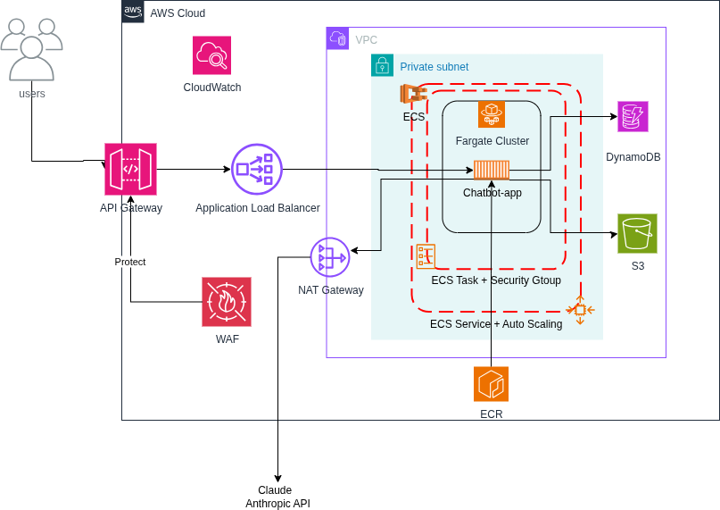

# Chatbot Service

* System code: `Chatbot-Service`
* Technologies: Spring Boot, DynamoDB, Spring AI (Anthropic Claude), Apache Maven

## Overview
The Chatbot Service is a Spring Boot application that provides a chatbot interface using the Anthropic Claude AI model. It interacts with a DynamoDB database for storing and retrieving conversation data.

## Architecture 
### Diagram


### High-Level Architecture - Core Components
1. API Gateway Layer: Request routing and API management
2. Application Layer: Core business logic and chat processing
3. AI Integration Layer: Claude Anthropic API
4. Data Layer: Chat history and document storage

### Components Breakdown
1.  AWS API Gateway
    * Act as the entry point
    * Routes requests to appropriate services
    * Implements rate limiting and request validation
2. Application Load Balancer ALB
     * distributing traffic to backend compute nodes
3. EC2/ECS clusters (Fargate)
    * Runs the stateless Spring Boot application
    * Auto-scales based on metrics.
4. DynamoDB
    * Storing chat sessions and messages
    * Scalable, low-latency
5. S3
    * Optional for storing (Attached Image, Documents)
6. VPC
    * Isolated network for secure communication
7. CloudWatch
    * Monitoring and logging
    * Metrics for performance and error tracking
8. Anthropic Claude
    * AI model for generating responses
    * Integrated via Spring AI
9. NAT Gateway
    * Allows outbound internet access for ECS tasks
10. WAF
    * Protects the API Gateway from common web exploits

### Architecture Flow:

1. Users accessing endpoints via API Gateway 
2. API Gateway forwarding to a Load Balancer 
3. Load Balancer routing to ECS service with Spring Boot 
4. Spring Boot making calls to LLMs and storing/retrieving from DynamoDB/RDS

## Local Development Setup
### Ensure you have the following installed:
   - Java 21 or higher
   - Apache Maven
   - Docker (for running DynamoDB locally)
   - AWS CLI (optional, for managing DynamoDB)
   - An Anthropic API key (for Claude model access)

### Steps to run the service locally:

### Environment variables for local build/start:

| variable                 | value                  |
|--------------------------|------------------------|
| CB_PROFILE               | dev                    |
| CB_AWS_DYNAMODB_ENDPOINT | http://localhost:8000  |
| CB_AWS_DYNAMODB_REGION   | us-east-1              |
| CB_AWS_ACCESS_KEY_ID     |                        |
| CB_AWS_SECRET_ACCESS_KEY |                        |
| CB_CLAUDE_API_KEY        | dev                    |

### Run DynamoDB locally:
1. Pull the DynamoDB Docker image:
   ```bash
   docker pull amazon/dynamodb-local
   ```
2. Run the DynamoDB container:
   ```bash
    docker run -p 8000:8000 amazon/dynamodb-local
    ```
### Create the DynamoDB table:
You can create the DynamoDB table using the AWS CLI. Make sure you have the AWS CLI installed and configured with your credentials. 

#### Use the following command to create Tables 

* the `ChatSession` table:
   ```bash
      aws dynamodb create-table \
      --endpoint-url http://localhost:8000 \
      --table-name ChatSession \
      --attribute-definitions \
          AttributeName=sessionId,AttributeType=S \
      --key-schema \
          AttributeName=sessionId,KeyType=HASH \
      --billing-mode PAY_PER_REQUEST
   ```
* the `ChatMessage` table:
  ```bash
    aws dynamodb create-table \
    --endpoint-url http://localhost:8000 \
    --table-name ChatMessage \
    --attribute-definitions \
        AttributeName=sessionId,AttributeType=S \
        AttributeName=messageId,AttributeType=S \
    --key-schema \
        AttributeName=sessionId,KeyType=HASH \
        AttributeName=messageId,KeyType=RANGE \
    --billing-mode PAY_PER_REQUEST
   ```
    
### Verification Dynamodb Tables Command
   ```bash
      aws dynamodb list-tables --endpoint-url http://localhost:8000
   ```

### Build and run the application:
  ```bash
    mvn clean install
    mvn spring-boot:run
  ```

### Creating a Docker Image

```bash
  docker build -t chatbot-service .
```